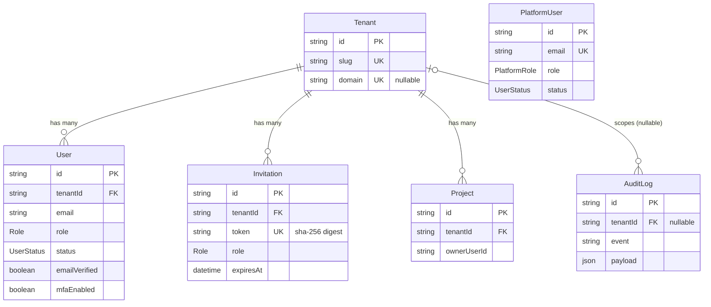

# Database schema walkthrough

A table-by-table tour of [`apps/api/prisma/schema.prisma`](../apps/api/prisma/schema.prisma): what each field is for, where it is nullable, and how the user tables map onto the `@bymax-one/nest-auth` repository contracts. Read this before forking the schema for your own app.

> **Table naming.** The schema declares no `@@map`, so Prisma generates PascalCase, singular table names (`User`, `PlatformUser`, `AuditLog`, …) with camelCase columns — exactly as they appear in [the init migration](../apps/api/prisma/migrations/20260419165350_init/migration.sql). This walkthrough uses the Prisma model names.

---

## Entity relationships

Three enums back the columns above:

- **`Role`** — `OWNER` · `ADMIN` · `MEMBER` · `VIEWER` (tenant-user RBAC; consumed verbatim by the library's `RolesGuard`).
- **`UserStatus`** — `ACTIVE` · `PENDING` · `SUSPENDED` · `BANNED` · `INACTIVE` (drives `UserStatusGuard`; see [`auth.constants.ts`](../apps/api/src/auth/auth.constants.ts) for the blocked set).
- **`PlatformRole`** — `SUPER_ADMIN` · `SUPPORT` (platform-admin RBAC).

---

## Connection & datasource (Prisma 7)

In Prisma 7 the `url` was removed from the `datasource` block in `schema.prisma`. Two things provide it instead:

- **CLI** (`prisma generate`, `prisma migrate …`, `prisma db seed`) reads it from [`apps/api/prisma.config.ts`](../apps/api/prisma.config.ts) via `env('DATABASE_URL')`.
- **Runtime** `PrismaClient` is constructed with the `@prisma/adapter-pg` (`PrismaPg`) adapter inside [`PrismaService`](../apps/api/src/prisma/prisma.service.ts), which receives the connection string from the validated config.

---

## Tables

### `User` — tenant-scoped account

Maps 1:1 onto the `AuthUser` shape required by the library's `IUserRepository`, implemented by [`PrismaUserRepository`](../apps/api/src/auth/prisma-user.repository.ts) (FCM #32).

| Column             | Type          | Nullable | Purpose                                                                       |
| ------------------ | ------------- | -------- | ----------------------------------------------------------------------------- |
| `id`               | `String` cuid | no       | Primary key; opaque, URL-safe.                                                |
| `tenantId`         | `String`      | no       | Owning tenant. Every query scopes by it. FK → `Tenant` (`onDelete: Cascade`). |
| `email`            | `String`      | no       | Login identifier; unique **within** a tenant.                                 |
| `name`             | `String`      | no       | Display name.                                                                 |
| `passwordHash`     | `String?`     | yes      | **Stored verbatim** from the library. Null for OAuth-only accounts.           |
| `role`             | `Role`        | no       | RBAC role; default `MEMBER`.                                                  |
| `status`           | `UserStatus`  | no       | Lifecycle state; default `ACTIVE`. Blocked values deny login.                 |
| `emailVerified`    | `Boolean`     | no       | Set after the OTP verification flow; default `false`.                         |
| `mfaEnabled`       | `Boolean`     | no       | Whether TOTP is active; default `false`.                                      |
| `mfaSecret`        | `String?`     | yes      | **AES-encrypted by the library — stored verbatim. Never re-encrypt.**         |
| `mfaRecoveryCodes` | `String[]`    | —        | **Hashed by the library — stored verbatim. Never re-hash.**                   |
| `oauthProvider`    | `String?`     | yes      | e.g. `google`. Part of the OAuth identity composite key.                      |
| `oauthProviderId`  | `String?`     | yes      | Provider's stable user ID.                                                    |
| `lastLoginAt`      | `DateTime?`   | yes      | Updated on each successful login.                                             |
| `createdAt`        | `DateTime`    | no       | Row creation timestamp.                                                       |
| `updatedAt`        | `DateTime`    | no       | Auto-updated on write.                                                        |

Constraints: `@@unique([tenantId, email])` (two tenants may reuse an email), `@@unique([oauthProvider, oauthProviderId])` (NULLs don't collide in Postgres), `@@index([tenantId])`.

### `PlatformUser` — global operator identity

Mirrors the `AuthPlatformUser` required by `IPlatformUserRepository`, implemented by [`PrismaPlatformUserRepository`](../apps/api/src/auth/prisma-platform-user.repository.ts). **Not** tenant-scoped — platform users have their own JWT context (`JwtPlatformGuard`) and never appear in tenant-user queries (FCM #22).

| Column             | Type           | Nullable | Purpose                                                |
| ------------------ | -------------- | -------- | ------------------------------------------------------ |
| `id`               | `String` cuid  | no       | Primary key.                                           |
| `email`            | `String`       | no       | Globally unique (`@unique`).                           |
| `name`             | `String`       | no       | Display name.                                          |
| `passwordHash`     | `String`       | no       | Required — OAuth is not supported for platform users.  |
| `role`             | `PlatformRole` | no       | `SUPER_ADMIN` or `SUPPORT`; default `SUPPORT`.         |
| `status`           | `UserStatus`   | no       | Reuses the tenant `UserStatus` enum; default `ACTIVE`. |
| `mfaEnabled`       | `Boolean`      | no       | Default `false`.                                       |
| `mfaSecret`        | `String?`      | yes      | Stored verbatim if MFA is enabled.                     |
| `mfaRecoveryCodes` | `String[]`     | —        | Stored verbatim.                                       |
| `platformId`       | `String?`      | yes      | Optional grouping for multi-platform deployments.      |
| `lastLoginAt`      | `DateTime?`    | yes      | Updated on each successful platform login.             |
| `createdAt`        | `DateTime`     | no       | Row creation timestamp.                                |
| `updatedAt`        | `DateTime`     | no       | Auto-updated on write.                                 |

### `Tenant` — isolation boundary (app-owned)

Owned by this example, not the library. Demonstrates how a real app correlates its own data with the library's tenant id.

| Column      | Type          | Nullable | Purpose                                                                                     |
| ----------- | ------------- | -------- | ------------------------------------------------------------------------------------------- |
| `id`        | `String` cuid | no       | Primary key. **This is the value sent in the `X-Tenant-Id` header** — a cuid, not the slug. |
| `name`      | `String`      | no       | Human-readable tenant name.                                                                 |
| `slug`      | `String`      | no       | URL-safe identifier (`@unique`), e.g. `acme`.                                               |
| `domain`    | `String?`     | yes      | Optional custom domain (`@unique`).                                                         |
| `createdAt` | `DateTime`    | no       | Row creation timestamp.                                                                     |
| `updatedAt` | `DateTime`    | no       | Auto-updated on write.                                                                      |

Relations: `users`, `invitations`, `auditLogs`, `projects`.

### `Invitation` — pending/accepted tenant invite (app-owned)

Backs FCM #21. Populated by [`InvitationsService`](../apps/api/src/invitations/invitations.service.ts); the raw invite token is only ever emailed, never persisted.

| Column            | Type          | Nullable | Purpose                                                                                         |
| ----------------- | ------------- | -------- | ----------------------------------------------------------------------------------------------- |
| `id`              | `String` cuid | no       | Primary key.                                                                                    |
| `tenantId`        | `String`      | no       | Target tenant. FK → `Tenant` (`onDelete: Cascade`).                                             |
| `email`           | `String`      | no       | Invitee's email.                                                                                |
| `role`            | `Role`        | no       | Role granted on acceptance.                                                                     |
| `token`           | `String`      | no       | **SHA-256 hex digest** of the raw token (`@unique`). Never the raw value.                       |
| `invitedByUserId` | `String`      | no       | Inviter's user id.                                                                              |
| `expiresAt`       | `DateTime`    | no       | Expiry (library token TTL is 48 h — see [auth.config.ts](../apps/api/src/auth/auth.config.ts)). |
| `acceptedAt`      | `DateTime?`   | yes      | Set when the invite is accepted.                                                                |
| `createdAt`       | `DateTime`    | no       | Row creation timestamp.                                                                         |
| `updatedAt`       | `DateTime`    | no       | Auto-updated on write.                                                                          |

Index: `@@index([tenantId, createdAt])`.

### `AuditLog` — immutable lifecycle record (app-owned)

Append-only. Written by [`AppAuthHooks`](../apps/api/src/auth/app-auth.hooks.ts) (the `IAuthHooks` implementation) for every library lifecycle event (FCM #30). Rows are never updated or deleted — that is why there is **no `updatedAt`**.

| Column                | Type          | Nullable | Purpose                                                              |
| --------------------- | ------------- | -------- | -------------------------------------------------------------------- |
| `id`                  | `String` cuid | no       | Primary key.                                                         |
| `tenantId`            | `String?`     | yes      | Null for platform-level events. FK → `Tenant` (`onDelete: SetNull`). |
| `actorUserId`         | `String?`     | yes      | Tenant user that triggered the event, if any.                        |
| `actorPlatformUserId` | `String?`     | yes      | Platform user that triggered the event, if any.                      |
| `event`               | `String`      | no       | Event slug, e.g. `user.login.succeeded`, `mfa.enabled`.              |
| `payload`             | `Json`        | no       | Structured detail. **Never contains tokens, hashes, or OTPs.**       |
| `ip`                  | `String?`     | yes      | Source IP, when available.                                           |
| `userAgent`           | `String?`     | yes      | Request user agent, when available.                                  |
| `createdAt`           | `DateTime`    | no       | Event timestamp.                                                     |

Indexes: `@@index([tenantId, createdAt(sort: Desc)])`, `@@index([event, createdAt(sort: Desc)])`.

### `Project` — example domain entity (app-owned)

Toy resource that demonstrates `@Roles` RBAC and `tenantId` scoping in [`ProjectsController`](../apps/api/src/projects/projects.controller.ts) (FCM #18–#20).

| Column        | Type          | Nullable | Purpose                                             |
| ------------- | ------------- | -------- | --------------------------------------------------- |
| `id`          | `String` cuid | no       | Primary key.                                        |
| `tenantId`    | `String`      | no       | Owning tenant. FK → `Tenant` (`onDelete: Cascade`). |
| `name`        | `String`      | no       | Project name.                                       |
| `ownerUserId` | `String`      | no       | Creating user's id.                                 |
| `createdAt`   | `DateTime`    | no       | Row creation timestamp.                             |
| `updatedAt`   | `DateTime`    | no       | Auto-updated on write.                              |

Index: `@@index([tenantId])`.

---

## Library-owned fields — never transform

Three columns are produced by `@bymax-one/nest-auth` and stored **exactly** as the library returns them. Re-hashing or re-encrypting any of them locks users out or breaks decryption:

| Field              | Owned by                  | Rule                                                                  |
| ------------------ | ------------------------- | --------------------------------------------------------------------- |
| `passwordHash`     | library `PasswordService` | Store verbatim. Never re-hash. (scrypt `scrypt:{salt}:{key}` format.) |
| `mfaSecret`        | library MFA service       | AES-encrypted at rest by the library. Store verbatim.                 |
| `mfaRecoveryCodes` | library MFA service       | Hashed by the library. Store verbatim.                                |

The repository implementations select and persist these as opaque strings — see [`PrismaUserRepository`](../apps/api/src/auth/prisma-user.repository.ts).

---

## Migrations

Migrations live under [`apps/api/prisma/migrations/`](../apps/api/prisma/migrations/). Two exist today: the initial schema and one that added `updatedAt` to `Invitation` and `Project`.

| Context   | Command                                                      | Behaviour                                                                      |
| --------- | ------------------------------------------------------------ | ------------------------------------------------------------------------------ |
| Local dev | `pnpm --filter @nest-auth-example/api prisma:migrate`        | `prisma migrate dev` — creates/applies a migration and regenerates the client. |
| CI / prod | `pnpm --filter @nest-auth-example/api prisma:migrate:deploy` | `prisma migrate deploy` — applies committed migrations only; never generates.  |

Never use `prisma db push` here — it bypasses the migration history. See [troubleshooting](./TROUBLESHOOTING.md#prisma-migrate-vs-db-push).

---

## Seeds

`pnpm --filter @nest-auth-example/api prisma:seed` runs `prisma db seed`, which the [Prisma config](../apps/api/prisma.config.ts) maps to `tsx prisma/seed.ts`. The seed ([`seed.ts`](../apps/api/prisma/seed.ts)) is **idempotent** (every write is an `upsert` on a natural unique key) and produces:

- **2 tenants** — `acme` (Acme Corp) and `globex` (Globex Inc).
- **8 tenant users** — one per role (`owner`/`admin`/`member`/`viewer`) per tenant, e.g. `admin.acme@example.com`, all with password `Passw0rd!Passw0rd`.
- **2 e2e users** in `acme` — `member@example.dev` and `admin@example.dev` (used by the Playwright suite).
- **2 platform admins** — `platform@example.com` and `platform@example.dev`.

Passwords are hashed with scrypt in the exact `scrypt:{salt_hex}:{derived_hex}` format the library's `PasswordService` expects. The seed prints the generated tenant cuids and credentials in a banner — copy a tenant id for the `X-Tenant-Id` header. **Dev-only**; never run in production. Full credential list in [getting started](./GETTING_STARTED.md#seeded-credentials).

---

## Further reading

- [Features](./FEATURES.md) — how each table is exercised by a user-facing flow.
- [Redis](./REDIS.md) — ephemeral state (sessions, OTPs, invite tokens) that complements these tables.
- [Appendix B — Library export → file map](./DEVELOPMENT_PLAN.md#appendix-b--library-export--example-file-map) — the repository interfaces these models satisfy.
