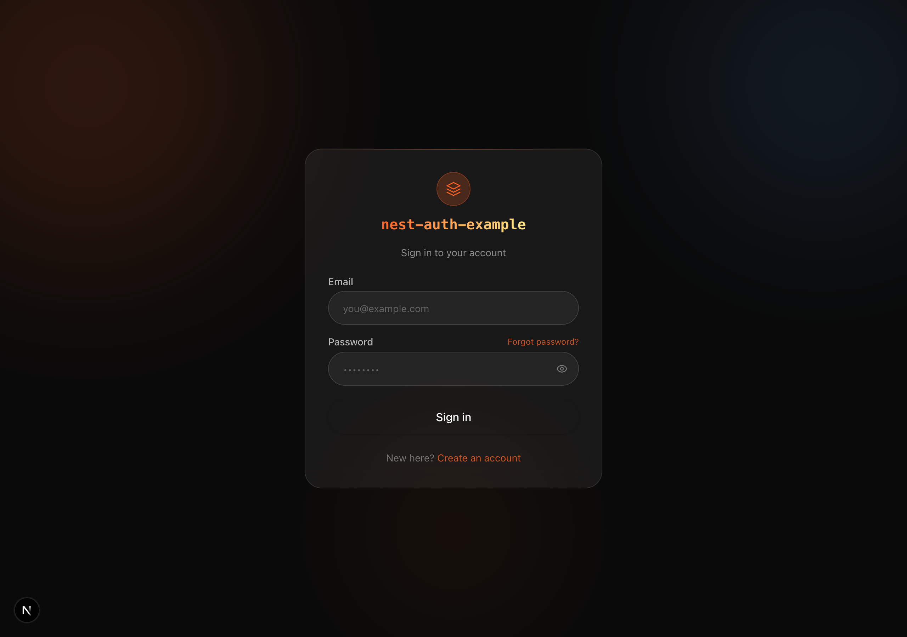
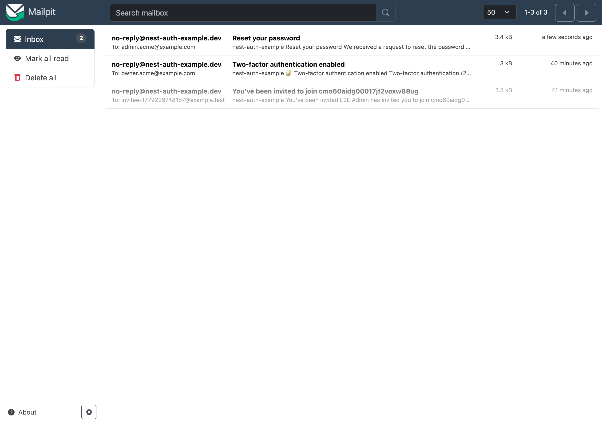
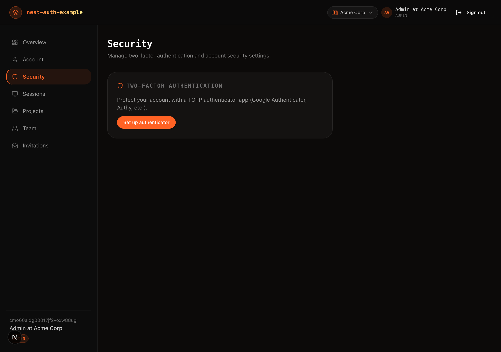
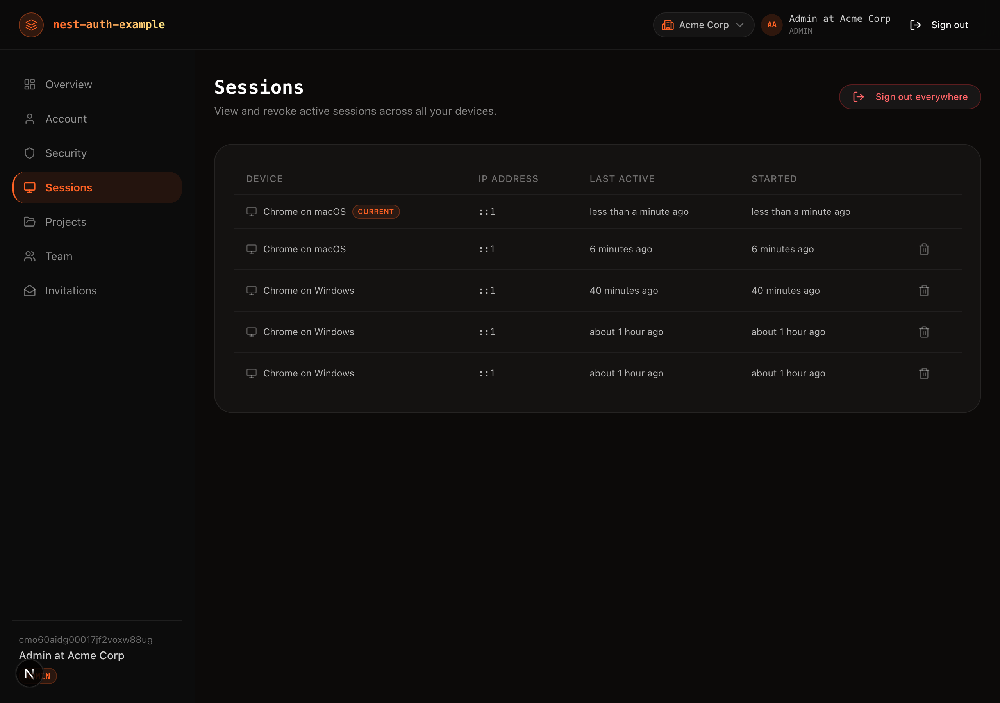
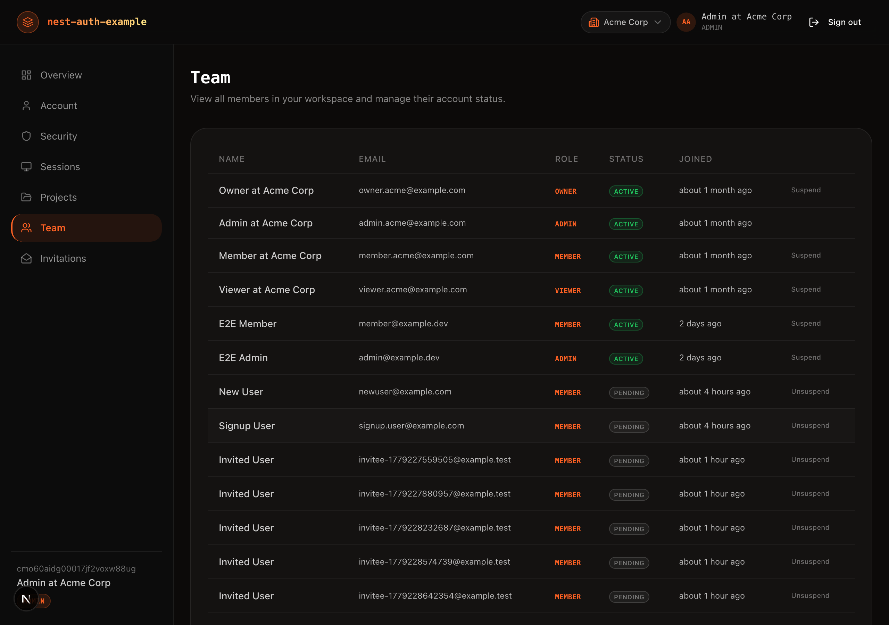
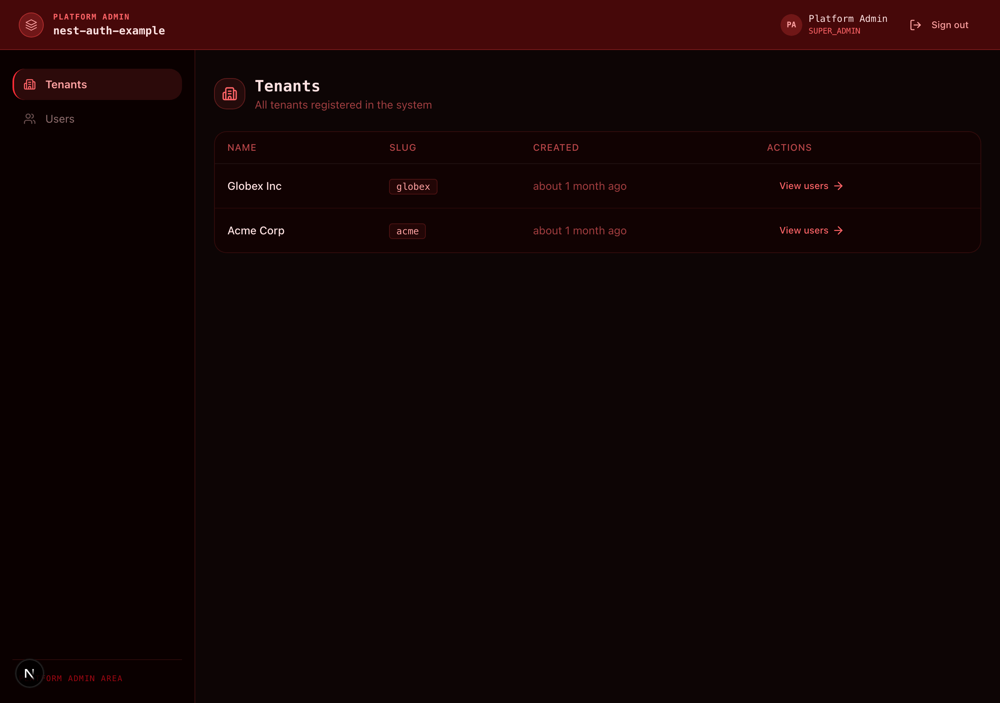
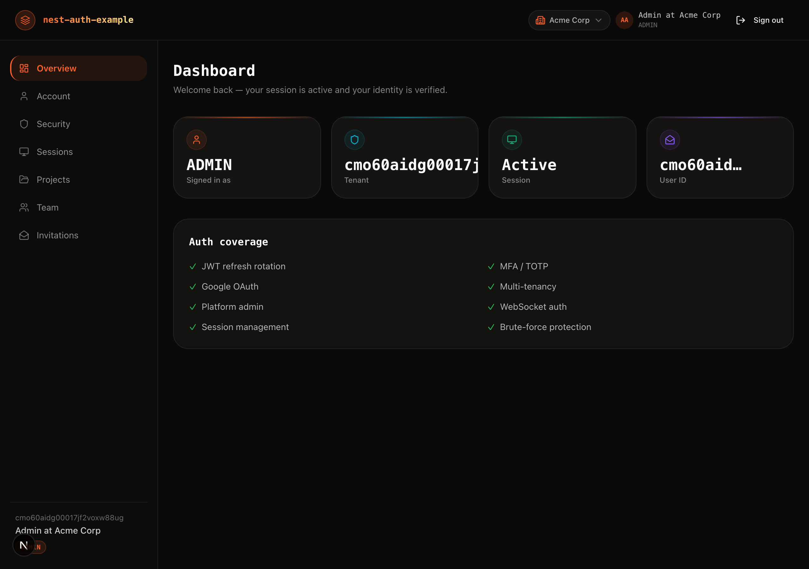

# Features

A guided tour of every feature in the [Feature Coverage Matrix](./OVERVIEW.md) (OVERVIEW §6). One section per matrix row, each with a short intro, the **library API** used (with `file:line` links into the source), a reproducible **walkthrough** (UI clicks or `curl`), and a screenshot where it clarifies the flow.

Conventions used below:

- The API is mounted under the global `/api` prefix; auth routes live at `/api/auth/*` ([`main.ts`](../apps/api/src/main.ts), [`auth.config.ts`](../apps/api/src/auth/auth.config.ts)).
- `X-Tenant-Id` is the tenant's **cuid**, not its slug. Seeded `acme` = `cmo60aidg00017jf2voxw88ug` (yours will differ — see the seed banner).
- Seeded credentials are listed in [getting started](./GETTING_STARTED.md#seeded-credentials).

**Index:** [1](#1-email--password-registration) · [2](#2-login-cookie-mode) · [3](#3-jwt-access--refresh-rotation) · [4](#4-jwt-revocation) · [5](#5-email-verification-otp) · [6](#6-password-reset--token-mode) · [7](#7-password-reset--otp-mode) · [8](#8-totp-mfa-enrollment--qr) · [9](#9-totp-mfa-challenge-on-login) · [10](#10-mfa-recovery-codes) · [11](#11-mfa-disable) · [12](#12-oauth-google) · [13](#13-active-sessions-listing--revoke) · [14](#14-session-limit--fifo-eviction) · [15](#15-new-session-email-alerts) · [16](#16-brute-force-protection) · [17](#17-per-route-throttling) · [18](#18-rbac-with-hierarchy) · [19](#19-currentuser-public-skipmfa-decorators) · [20](#20-multi-tenant-isolation) · [21](#21-user-invitations) · [22](#22-platform-admin-context) · [23](#23-account-status-enforcement) · [24](#24-websocket-auth) · [25](#25-usesession--useauth--useauthstatus) · [26](#26-edge-proxy-gating) · [27](#27-silent--client-refresh-handlers) · [28](#28-logout-handler) · [29](#29-shared-error-codes-anti-enumeration) · [30](#30-audit--lifecycle-hooks) · [31](#31-custom-email-provider) · [32](#32-custom-user-repository)

---

## 1. Email + password registration

New users register with email, password, name, and a tenant. The library owns `POST /api/auth/register` (`RegisterDto`); the example provides the form.

- **Library API:** `BymaxAuthModule` mounts the route — [`auth.module.ts`](../apps/api/src/auth/auth.module.ts). Form: [`app/auth/register/page.tsx`](../apps/web/app/auth/register/page.tsx).
- **Walkthrough (curl):**
  ```bash
  curl -X POST http://localhost:4000/api/auth/register \
    -H 'Content-Type: application/json' -H 'X-Tenant-Id: <tenant-cuid>' \
    -d '{"email":"new@acme.test","password":"Passw0rd!Passw0rd","name":"New User"}'
  ```
  Then check Mailpit for the verification email (see [#5](#5-email-verification-otp)).

## 2. Login (cookie mode)

Credentials are exchanged for HttpOnly `access_token` + `refresh_token` cookies; `<AuthProvider>` hydrates the client session.

- **Library API:** `POST /api/auth/login`; tokens delivered as cookies per [`auth.config.ts`](../apps/api/src/auth/auth.config.ts) `jwt`. Form: [`app/auth/login/page.tsx`](../apps/web/app/auth/login/page.tsx); provider: [`app/providers.tsx`](../apps/web/app/providers.tsx).
- **Walkthrough (UI):** open `http://localhost:3000/auth/login?tenantId=acme` → enter `admin.acme@example.com` / `Passw0rd!Passw0rd` → **Sign in** → redirected to `/dashboard`.



## 3. JWT access + refresh rotation

Short-lived access tokens (15 min) are refreshed against long-lived refresh tokens (7 days) with a 30 s grace window so concurrent requests during rotation don't fail.

- **Library API:** `jwt: { accessExpiresIn: '15m', refreshExpiresInDays: 7, refreshGraceWindowSeconds: 30 }` in [`auth.config.ts`](../apps/api/src/auth/auth.config.ts). Refresh handler: [`app/api/auth/silent-refresh/route.ts`](../apps/web/app/api/auth/silent-refresh/route.ts).
- **Walkthrough:** stay on the dashboard; as the access token nears expiry the silent-refresh route rotates it transparently. See the [refresh sequence diagram](./ARCHITECTURE.md#silent-refresh).

## 4. JWT revocation

Logout (and "sign out everywhere") blacklists the access token's `jti` in Redis so it is rejected before its natural expiry.

- **Library API:** revocation key `rv:{jti}` (see [redis](./REDIS.md#the-one-un-namespaced-key-rvjti)). UI: [`sign-out-everywhere-button.tsx`](../apps/web/components/dashboard/sign-out-everywhere-button.tsx).
- **Walkthrough (UI):** **Dashboard → Sessions → Sign out everywhere**. Every other session's next request returns `401` with code `TOKEN_REVOKED`.

## 5. Email verification (OTP)

Registration sends a one-time code; the user confirms it to set `emailVerified`.

- **Library API:** `emailVerification: { required: true, otpTtlSeconds: 600 }` in [`auth.config.ts`](../apps/api/src/auth/auth.config.ts); email via [`mailpit-email.provider.ts` `sendEmailVerificationOtp`](../apps/api/src/auth/mailpit-email.provider.ts). Page: [`app/auth/verify-email/page.tsx`](../apps/web/app/auth/verify-email/page.tsx).
- **Walkthrough (UI):** register → open [Mailpit](http://localhost:8025) → copy the code from **Verify your email address** → enter it on `/auth/verify-email`.



## 6. Password reset — token mode

Default mode: a signed reset link is emailed; the link carries `email`, `tenantId`, and `token`.

- **Library API:** `passwordReset: { method: 'token', tokenTtlSeconds: 600 }` in [`auth.config.ts`](../apps/api/src/auth/auth.config.ts); email via [`mailpit-email.provider.ts` `sendPasswordResetToken`](../apps/api/src/auth/mailpit-email.provider.ts). Pages: [`forgot-password`](../apps/web/app/auth/forgot-password/page.tsx), [`reset-password`](../apps/web/app/auth/reset-password/page.tsx).
- **Walkthrough (UI):** `/auth/forgot-password?tenantId=acme` → submit your email → open the **Reset your password** email in Mailpit → follow the link → set a new password.

## 7. Password reset — OTP mode

Same flow with `PASSWORD_RESET_METHOD=otp`: a numeric code is emailed instead of a link.

- **Library API:** `passwordReset.method: 'otp'` ([`auth.config.ts`](../apps/api/src/auth/auth.config.ts)); email via [`sendPasswordResetOtp`](../apps/api/src/auth/mailpit-email.provider.ts). Same pages with `?mode=otp`.
- **Walkthrough (UI):** set `PASSWORD_RESET_METHOD=otp`, restart the API → `/auth/forgot-password?mode=otp` → enter the emailed code on `/auth/reset-password?mode=otp`.

## 8. TOTP MFA enrollment + QR

Users enable two-factor auth by scanning a QR code with an authenticator app and confirming a code.

- **Library API:** `mfa: { encryptionKey, issuer: 'nest-auth-example', recoveryCodeCount: 8 }` in [`auth.config.ts`](../apps/api/src/auth/auth.config.ts); `controllers.mfa: true` in [`auth.module.ts`](../apps/api/src/auth/auth.module.ts). UI: [`mfa-setup-card.tsx`](../apps/web/components/dashboard/mfa-setup-card.tsx).
- **Walkthrough (UI):** **Dashboard → Security → Set up authenticator** → scan the QR → enter the 6-digit code to confirm.



## 9. TOTP MFA challenge on login

When MFA is enabled, login returns `mfa_required` and the user is challenged for a code.

- **Library API:** `MfaChallengeDto`, `MfaRequiredGuard`. Page: [`app/auth/mfa-challenge/page.tsx`](../apps/web/app/auth/mfa-challenge/page.tsx).
- **Walkthrough (UI):** with MFA on, sign in → redirected to `/auth/mfa-challenge` → enter the current TOTP code → reach the dashboard.

## 10. MFA recovery codes

Enrollment issues 8 single-use recovery codes for when the authenticator is unavailable.

- **Library API:** `mfa.recoveryCodeCount: 8` ([`auth.config.ts`](../apps/api/src/auth/auth.config.ts)). UI: [`recovery-codes-modal.tsx`](../apps/web/components/dashboard/recovery-codes-modal.tsx).
- **Walkthrough (UI):** after enabling MFA, the recovery-codes modal appears — download/store them. On the challenge page, a recovery code works in place of a TOTP code.

## 11. MFA disable

Users can turn MFA off; a security email confirms the change.

- **Library API:** `MfaDisableDto`; email via [`sendMfaDisabledNotification`](../apps/api/src/auth/mailpit-email.provider.ts). UI: [`mfa-disable-card.tsx`](../apps/web/components/dashboard/mfa-disable-card.tsx).
- **Walkthrough (UI):** **Dashboard → Security → Disable** → confirm. A **Two-factor authentication disabled** email lands in Mailpit.

## 12. OAuth (Google)

"Continue with Google" signs in (or links) via the Google plugin. The OAuth controller is only mounted when both client env vars are set.

- **Library API:** `controllers.oauth` toggled by `isGoogleOAuthConfigured()` in [`auth.module.ts`](../apps/api/src/auth/auth.module.ts); linking handled in [`app-auth.hooks.ts`](../apps/api/src/auth/app-auth.hooks.ts) `onOAuthLogin`. Button: [`app/auth/login/page.tsx:213`](../apps/web/app/auth/login/page.tsx).
- **Walkthrough:** set `OAUTH_GOOGLE_CLIENT_ID`/`SECRET`/`CALLBACK_URL` and `NEXT_PUBLIC_OAUTH_GOOGLE_ENABLED=true` → the button appears → it hits `GET /api/auth/oauth/google/start`, redirects to Google, and on callback either links (same email) or creates a verified account. Covered by [`oauth-link.e2e-spec.ts`](../apps/api/test/oauth-link.e2e-spec.ts).

## 13. Active sessions listing + revoke

Users see their active sessions and can revoke one or all.

- **Library API:** `controllers.sessions: true` ([`auth.module.ts`](../apps/api/src/auth/auth.module.ts)); `GET`/`DELETE /api/auth/sessions`. Backed by `sess:`/`sd:` Redis keys ([redis](./REDIS.md)). UI: [`app/dashboard/sessions/page.tsx`](../apps/web/app/dashboard/sessions/page.tsx), [`sessions-table.tsx`](../apps/web/components/dashboard/sessions-table.tsx).
- **Walkthrough (UI):** **Dashboard → Sessions** → revoke a row, or **Sign out everywhere**.



## 14. Session limit + FIFO eviction

Each user is capped at 5 concurrent sessions; the oldest is evicted first.

- **Library API:** `sessions: { defaultMaxSessions: 5, evictionStrategy: 'fifo' }` in [`auth.config.ts`](../apps/api/src/auth/auth.config.ts). Asserted by [`session-fifo-eviction.e2e-spec.ts`](../apps/api/test/session-fifo-eviction.e2e-spec.ts).
- **Walkthrough:** log in from 6 distinct clients; the first session's refresh token is evicted and its next refresh fails.

## 15. New-session email alerts

Each fresh login emails a security alert with device and IP.

- **Library API:** [`mailpit-email.provider.ts` `sendNewSessionAlert`](../apps/api/src/auth/mailpit-email.provider.ts). See [email](./EMAIL.md#transactional-emails).
- **Walkthrough (UI):** sign in → a **New sign-in detected on your account** message appears in [Mailpit](http://localhost:8025).

## 16. Brute-force protection

After 5 failed logins in a 15-minute window the account is locked; the login form surfaces `ACCOUNT_LOCKED`.

- **Library API:** `bruteForce: { maxAttempts: 5, windowSeconds: 900 }` in [`auth.config.ts`](../apps/api/src/auth/auth.config.ts); failure counter `lf:` in Redis. Demo trigger: [`debug.controller.ts:98`](../apps/api/src/debug/debug.controller.ts).
- **Walkthrough (curl):**
  ```bash
  curl -X POST http://localhost:4000/api/debug/lockout \
    -H 'Content-Type: application/json' \
    -d '{"tenantId":"<tenant-cuid>","email":"admin.acme@example.com"}'
  ```
  Then try to log in → `ACCOUNT_LOCKED`. Verified by [`brute-force-lockout.e2e-spec.ts`](../apps/api/test/brute-force-lockout.e2e-spec.ts).

## 17. Per-route throttling

Auth endpoints carry tighter rate limits via `@nestjs/throttler` and `AUTH_THROTTLE_CONFIGS`.

- **Library API:** `ThrottlerModule.forRoot(...)` in [`app.module.ts:88`](../apps/api/src/app.module.ts); per-route `@Throttle(AUTH_THROTTLE_CONFIGS.*)`.
- **Walkthrough:** hammer a throttled route past its limit → `429 Too Many Requests`. See [`throttle-demo.e2e-spec.ts`](../apps/api/test/throttle-demo.e2e-spec.ts).

## 18. RBAC with hierarchy

Roles form a hierarchy (`OWNER > ADMIN > MEMBER > VIEWER`); `@Roles` + `RolesGuard` enforce it.

- **Library API:** `roles.hierarchy` in [`auth.config.ts`](../apps/api/src/auth/auth.config.ts); `@Roles('ADMIN')` at [`projects.controller.ts:70`](../apps/api/src/projects/projects.controller.ts). Frontend role-gated nav: [`proxy.ts`](../apps/web/proxy.ts).
- **Walkthrough (UI):** as `viewer.acme@example.com`, the **Team** and **Invitations** nav items are hidden/forbidden; as `admin`/`owner` they appear. Verified by [`rbac.e2e-spec.ts`](../apps/api/test/rbac.e2e-spec.ts).



## 19. `@CurrentUser`, `@Public`, `@SkipMfa` decorators

Server decorators inject the authenticated user and opt routes out of the global guards.

- **Library API:** `@CurrentUser()` at [`projects.controller.ts:52`](../apps/api/src/projects/projects.controller.ts); `@Public`/`@SkipMfa` used across `projects/` and `tenants/`.
- **Walkthrough:** `GET /api/projects` returns only the caller's tenant's projects, identified via `@CurrentUser()` — no manual token parsing.

## 20. Multi-tenant isolation

Every user-facing row carries `tenantId`; the resolver reads it **only** from the `X-Tenant-Id` header.

- **Library API:** `tenantIdResolver` at [`auth.config.ts:167`](../apps/api/src/auth/auth.config.ts). Tenant switcher: [`tenant-switcher.tsx`](../apps/web/components/auth/tenant-switcher.tsx).
- **Walkthrough (UI):** the dashboard top-bar shows the active tenant; switching re-scopes every query. Cross-tenant access is rejected — see [`tenant-isolation.e2e-spec.ts`](../apps/api/test/tenant-isolation.e2e-spec.ts) and [database](./DATABASE.md#tenant--isolation-boundary-app-owned).

## 21. User invitations

Admins invite teammates by email; the recipient accepts via a tokenized link.

- **Library API:** `controllers.invitations: true` + `invitations.tokenTtlSeconds: 172800` (48 h) in [`auth.config.ts`](../apps/api/src/auth/auth.config.ts); persisted by [`invitations.service.ts`](../apps/api/src/invitations/invitations.service.ts); email via [`sendInvitation`](../apps/api/src/auth/mailpit-email.provider.ts). UI: [`app/dashboard/invitations/page.tsx`](../apps/web/app/dashboard/invitations/page.tsx) → [`app/auth/accept-invitation/page.tsx`](../apps/web/app/auth/accept-invitation/page.tsx).
- **Walkthrough (UI):** **Dashboard → Invitations → Invite** → recipient opens the **You've been invited** email → accepts → joins with the assigned role.

## 22. Platform admin context

A separate admin portal with its own JWT context (`JwtPlatformGuard`), bearer tokens, and red theme — no leakage into tenant sessions.

- **Library API:** `platform: { enabled: true }` ([`auth.config.ts`](../apps/api/src/auth/auth.config.ts)); guards at [`platform.controller.ts:55`](../apps/api/src/platform/platform.controller.ts). UI: [`app/platform/login/page.tsx`](../apps/web/app/platform/login/page.tsx). See [architecture](./ARCHITECTURE.md#platform-vs-dashboard-two-auth-contexts).
- **Walkthrough (UI):** `http://localhost:3000/platform/login` → `platform@example.dev` / `PlatformPassw0rd!` → tenants/users admin.



## 23. Account status enforcement

Blocked statuses (`SUSPENDED`, `BANNED`, `INACTIVE`) deny login and force-disconnect live sessions.

- **Library API:** `blockedStatuses` from [`auth.constants.ts`](../apps/api/src/auth/auth.constants.ts) (`UserStatusGuard`); status change in [`users.service.ts:81`](../apps/api/src/users/users.service.ts) also calls the gateway to drop sockets.
- **Walkthrough (UI):** as an admin, suspend a member; their next request is blocked and their WebSocket closes. Verified by [`status-enforcement.e2e-spec.ts`](../apps/api/test/status-enforcement.e2e-spec.ts).

## 24. WebSocket auth

The notifications gateway authenticates the WS upgrade with `WsJwtGuard`, reading the `access_token` cookie (or `Authorization: Bearer`) and checking the `rv:{jti}` revocation list.

- **Library API:** `WsJwtGuard` + `@UseGuards(WsJwtGuard)` at [`notifications.gateway.ts:83`](../apps/api/src/notifications/notifications.gateway.ts). Browser listener: [`notification-listener.tsx`](../apps/web/components/notifications/notification-listener.tsx).
- **Walkthrough (UI, dev only):** sign in → **Dashboard → Account → Send test notification** → a toast appears within ~1 s. Per-user isolation is asserted by [`notifications-isolation.spec.ts`](../apps/web/e2e/notifications-isolation.spec.ts). See [architecture](./ARCHITECTURE.md#websocket-authentication).

## 25. `useSession` / `useAuth` / `useAuthStatus`

React hooks expose the session, auth actions, and a lightweight authenticated flag to client components.

- **Library API:** `@bymax-one/nest-auth/react`, provided by `<AuthProvider>` in [`app/providers.tsx`](../apps/web/app/providers.tsx); consumed across `apps/web/components/**` and the dashboard pages.
- **Walkthrough (UI):** the dashboard greeting, top-bar identity, and role-gated nav all read from these hooks.



## 26. Edge proxy gating

`createAuthProxy` verifies the access cookie at the edge and redirects unauthenticated/role-mismatched requests before any page renders.

- **Library API:** `createAuthProxy` at [`proxy.ts:32`](../apps/web/proxy.ts) (`@bymax-one/nest-auth/nextjs`).
- **Walkthrough:** visit `/dashboard` while logged out → redirected to `/auth/login`. As a `MEMBER`, `/dashboard/team` (OWNER/ADMIN only) is blocked at the edge.

## 27. Silent + client refresh handlers

Two library-owned route handlers refresh tokens server-side without exposing the refresh token to JS.

- **Library API:** [`silent-refresh/route.ts:33`](../apps/web/app/api/auth/silent-refresh/route.ts) (`createSilentRefreshHandler`), [`client-refresh/route.ts:24`](../apps/web/app/api/auth/client-refresh/route.ts) (`createClientRefreshHandler`).
- **Walkthrough:** observed automatically during a session; the silent refresh is the background path, the client refresh is the explicit one. Covered by [`refresh-rotation.e2e-spec.ts`](../apps/api/test/refresh-rotation.e2e-spec.ts).

## 28. Logout handler

A library-owned route clears cookies and revokes the token.

- **Library API:** [`logout/route.ts:29`](../apps/web/app/api/auth/logout/route.ts) (`createLogoutHandler`).
- **Walkthrough (UI):** click **Sign out** → cookies cleared, `rv:{jti}` set, redirected to `/auth/login`.

## 29. Shared error codes (anti-enumeration)

All auth errors flow through a single code map so the UI never leaks whether an email exists.

- **Library API:** `AUTH_ERROR_CODES`; server mapping in [`auth-exception.filter.ts:72`](../apps/api/src/auth/auth-exception.filter.ts); client map in [`lib/auth-errors.ts`](../apps/web/lib/auth-errors.ts). See [architecture](./ARCHITECTURE.md#error-propagation).
- **Walkthrough:** a wrong password and an unknown email both surface as `INVALID_CREDENTIALS` — identical wording, no enumeration.

## 30. Audit / lifecycle hooks

Every lifecycle event is written to the append-only `AuditLog` table via the `IAuthHooks` implementation.

- **Library API:** [`app-auth.hooks.ts`](../apps/api/src/auth/app-auth.hooks.ts) (bound to `BYMAX_AUTH_HOOKS`). See [database → AuditLog](./DATABASE.md#auditlog--immutable-lifecycle-record-app-owned).
- **Walkthrough (SQL):**
  ```bash
  docker exec nest-auth-example-postgres-1 psql -U postgres -d example_app \
    -c 'SELECT event, "createdAt" FROM "AuditLog" ORDER BY "createdAt" DESC LIMIT 5;'
  ```

## 31. Custom email provider

The example implements `IEmailProvider` twice (Mailpit for dev, Resend for prod) and binds one at startup.

- **Library API:** `IEmailProvider` → [`mailpit-email.provider.ts`](../apps/api/src/auth/mailpit-email.provider.ts) and [`resend-email.provider.ts`](../apps/api/src/auth/resend-email.provider.ts), bound via `EMAIL_PROVIDER` in [`auth.module.ts`](../apps/api/src/auth/auth.module.ts). See [email](./EMAIL.md).
- **Walkthrough:** set `EMAIL_PROVIDER=resend` + `RESEND_API_KEY` → outbound mail switches to Resend with no code changes.

## 32. Custom user repository

`PrismaUserRepository` implements `IUserRepository`, mapping the library's `AuthUser` shape onto the Prisma `User` model.

- **Library API:** `IUserRepository` → [`prisma-user.repository.ts`](../apps/api/src/auth/prisma-user.repository.ts) (bound to `BYMAX_AUTH_USER_REPOSITORY`). See [database → User](./DATABASE.md#user--tenant-scoped-account).
- **Walkthrough:** all auth flows above persist through this repository; swap it for any datastore by implementing the same interface.

---

## Appendix — intentionally not demonstrated exports

The Phase 20 audit (`node scripts/audit-library-exports.mjs`) enforces that every public export from `@bymax-one/nest-auth` is referenced at least once in the `apps/` tree. The 26 symbols below are suppressed in `.audit-ignore.json` because wiring them in application code would be artificial or misleading — they are internal types, advanced-use tokens, or structural interfaces intended for library-plugin authors rather than consumer apps.

Each entry links to the tracking issue that records the rationale.

### Suppressed from `server` subpath

| Symbol                         | Why suppressed                                                                                                                                              |
| ------------------------------ | ----------------------------------------------------------------------------------------------------------------------------------------------------------- |
| `BYMAX_AUTH_OPTIONS`           | Module-options injection token; consumer apps read config via `ConfigService`, not this token. [#1](https://github.com/bymaxone/nest-auth-example/issues/1) |
| `ROLES_KEY`                    | Internal metadata key used by `RolesGuard`; apps use `@Roles()` decorator instead. [#1](https://github.com/bymaxone/nest-auth-example/issues/1)             |
| `PLATFORM_ROLES_KEY`           | Same pattern as `ROLES_KEY` for platform guards. [#1](https://github.com/bymaxone/nest-auth-example/issues/1)                                               |
| `AuthenticatedRequest`         | Apps use `@CurrentUser() user: DashboardJwtPayload` instead of extending Express `Request`. [#2](https://github.com/bymaxone/nest-auth-example/issues/2)    |
| `PlatformAuthenticatedRequest` | Same rationale for platform routes. [#2](https://github.com/bymaxone/nest-auth-example/issues/2)                                                            |
| `OAuthProviderPlugin`          | Extension point for custom OAuth providers; this app uses the built-in Google plugin. [#2](https://github.com/bymaxone/nest-auth-example/issues/2)          |
| `ResolvedOptions`              | Internal resolved-options type; only relevant when building library plugins. [#2](https://github.com/bymaxone/nest-auth-example/issues/2)                   |

### Suppressed from `nextjs` subpath

| Symbol                                                                                             | Why suppressed                                                                                                                                                                  |
| -------------------------------------------------------------------------------------------------- | ------------------------------------------------------------------------------------------------------------------------------------------------------------------------------- |
| `AuthProxyInstance`                                                                                | Return type of `createAuthProxy`; destructured as `const { proxy } = createAuthProxy(...)`. [#3](https://github.com/bymaxone/nest-auth-example/issues/3)                        |
| `ResolvedAuthProxyConfig`                                                                          | Internal resolved proxy config; not exposed to consumer apps. [#3](https://github.com/bymaxone/nest-auth-example/issues/3)                                                      |
| `HeadersLike`, `RequestWithHeaders`, `RequestWithUrl`                                              | Structural interfaces for mocking in library tests; not needed in application code. [#3](https://github.com/bymaxone/nest-auth-example/issues/3)                                |
| `JwtHeader`, `DecodedToken`                                                                        | Internal JWT-shape types used by `decodeJwtToken`; covered by inference. [#3](https://github.com/bymaxone/nest-auth-example/issues/3)                                           |
| `ClientRefreshHandler`, `ClientRefreshHandlerConfig`                                               | Return type and config for `createClientRefreshHandler`; covered by type inference. [#3](https://github.com/bymaxone/nest-auth-example/issues/3)                                |
| `LogoutHandler`, `LogoutHandlerConfig`, `LogoutHandlerRedirectConfig`, `LogoutHandlerStatusConfig` | Handler type aliases for `createLogoutHandler`. [#3](https://github.com/bymaxone/nest-auth-example/issues/3)                                                                    |
| `SilentRefreshHandler`, `SilentRefreshHandlerConfig`                                               | Handler type aliases for `createSilentRefreshHandler`. [#3](https://github.com/bymaxone/nest-auth-example/issues/3)                                                             |
| `ParsedSetCookie`                                                                                  | Internal cookie-parsing result type; used only inside the proxy. [#3](https://github.com/bymaxone/nest-auth-example/issues/3)                                                   |
| `dedupeSetCookieHeaders`, `getSetCookieHeaders`, `parseSetCookieHeader`                            | Low-level Set-Cookie utilities used internally by the proxy; consumer apps do not process cookie headers directly. [#3](https://github.com/bymaxone/nest-auth-example/issues/3) |

---

## Further reading

- [Architecture](./ARCHITECTURE.md) · [Database](./DATABASE.md) · [Redis](./REDIS.md) · [Email](./EMAIL.md)
- [Getting started](./GETTING_STARTED.md) and the seeded accounts that make these walkthroughs runnable.
- [Releases](./RELEASES.md) and [`CHANGELOG.md`](../CHANGELOG.md) for the library version each feature was verified against.
